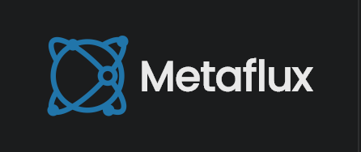

Providing automated and actionable information on changes happening on the surface of the planet in real-time.

## Development 

#### Dependencies

- Ruby 2
- NodeJS

#### Getting started

1. `bundle` and `npm install` to install application dependencies.
2. `gulp` to start your jekyll site locally with browser-sync. This initiates the `watch` method which monitors for file changes, builds the jekyll site and refreshes your browser, automatically.

#### Modifying SemanticUI

To make any changes to the site CSS, modify the `default` SemanticUI theme (/semantic/src/themes/default). The global settings such as typography and color schemes are defined in site.variables. 

After modifying the default theme, build it with `gulp build` (from within `/semantic`) and the site's CSS will be updated.

Thoughts:
- we should integrate SemanticUI's gulp functions with our root gulpfile.js. 
- we can pull SemanticUI out of this repo completely when we want to share it with other projects

### License

coming soon.